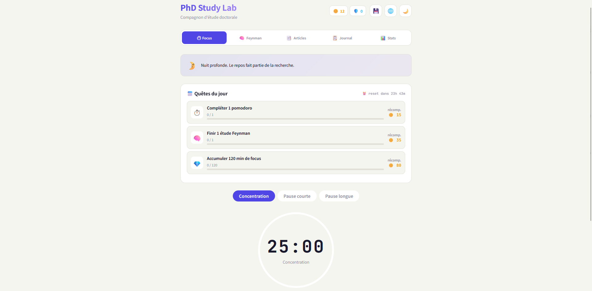

# Nine Lives Study

Nine Lives Study is a lightweight web application designed to **gamify focused work sessions** in order to improve motivation, consistency, and productivity over long periods of study or research.

It is live at **<https://ninelives.foussistan.fr>**.



## ✨ Features

- Paper notes — keep track of read literature
- Feynman method — four-step understanding records
- Daily tracker — tasks, mood and daily reflection
- Pomodoro — 25 / 5 timer with session history
- Mood journal — log mood anytime, history over 7/30/90 days
- Stats — overview, tasks/pomodoros/mood charts
- Gamification — XP and levels
- Multi-user (local), persistent SQLite storage

## 🏗️ Architecture

```
 ┌─────────────────┐
 │  Vite SPA       │  built into frontend/dist
 │  (TypeScript)   │
 └────────┬────────┘
          │ fetch /api/*
          ▼
 ┌─────────────────┐
 │  FastAPI        │  uvicorn on 127.0.0.1:8000
 │  (Python)       │
 └────────┬────────┘
          │
          ▼
 ┌─────────────────┐
 │  SQLite         │  backend/phdstudylab.db
 └─────────────────┘
```

In production, Caddy serves `frontend/dist/` and reverse-proxies `/api/*` to the backend.
See [docs/DEPLOYMENT.md](docs/DEPLOYMENT.md) for the full server architecture.

## 🚀 Quickstart (local dev)

### Requirements

- Python ≥ 3.10
- Node.js ≥ 18

### Backend

```bash
cd backend
conda create -n ninelives python=3.12
conda activate ninelives
pip install -r requirements.txt
uvicorn app.main:app --reload
```

The API listens on <http://127.0.0.1:8000>.

### Frontend

```bash
cd frontend
npm install
npm run dev
```

The dev server runs on <http://127.0.0.1:5173> and proxies API calls to `127.0.0.1:8000`.

## 📚 Documentation

- [docs/USER.md](docs/USER.md) — end-user guide (how to use the app)
- [docs/DEVELOPMENT.md](docs/DEVELOPMENT.md) — development workflow, code layout, conventions
- [docs/DEPLOYMENT.md](docs/DEPLOYMENT.md) — production server (foussistan.fr), ops manual

## 🔮 Roadmap

- CI/CD pipeline (GitHub Actions → auto-deploy on merge)
- Authentication (per-user data isolation on the public deployment)
- Real-time updates
- Mobile-first UI improvements

## 📄 License

See [LICENSE](LICENSE).
